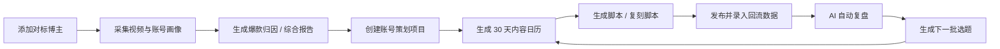
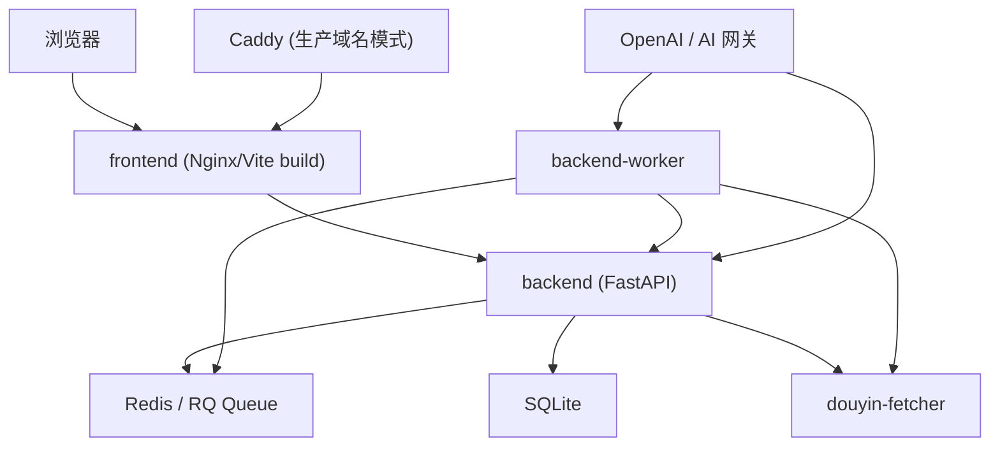
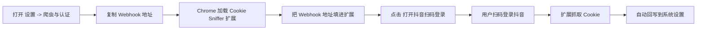
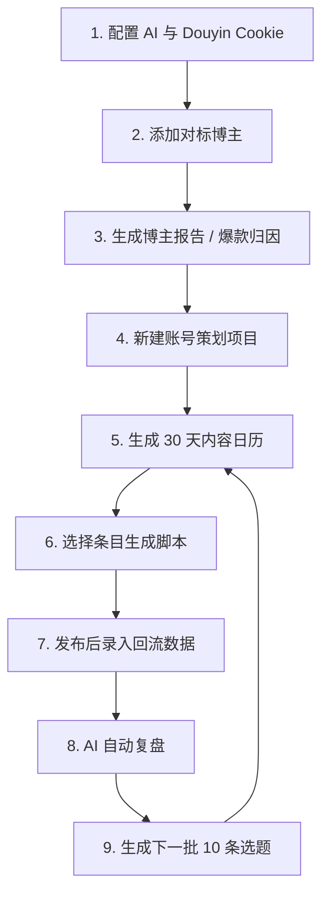

# Douyin Manager

一个面向抖音内容团队的内容策划工作台，覆盖：

- 博主采集与对标分析
- 代表作深度拆解
- AI 账号策划与 30 天内容日历
- 脚本生成与复刻
- 发布后数据回流
- AI 自动复盘与下一批选题生成

这不是一个单点工具，而是一条完整工作流：



## 1. 项目适合谁

- 短视频运营团队
- MCN / 代运营团队
- 本地商家内容团队
- 想把“选题 -> 脚本 -> 发布 -> 复盘”流程跑顺的人

## 2. 核心能力

### 博主 IP 库

- 添加抖音 / TikTok / Bilibili 博主
- 抓取视频标题、互动数据、账号画像
- 设置代表作做多模态深度分析
- 生成博主综合报告和爆款归因报告

### 策划工作台

- 互动问诊式创建账号策划项目
- 自动整理结构化草稿
- 结合对标博主生成账号定位
- 生成 30 天内容日历

### 脚本与复刻

- 根据日历条目生成脚本
- 根据爆款视频生成复刻脚本
- 支持编辑、继续迭代

### 回流与复盘

- 录入播放、点赞、评论、转化等数据
- AI 自动复盘
- 生成下一批 10 条选题
- 将新选题加入内容日历继续迭代

## 3. 系统架构



服务说明：

- `frontend`：前端页面与 `/api` 反代入口
- `backend`：主 API 服务
- `backend-worker`：后台任务执行器
- `douyin-fetcher`：抖音抓取与 Cookie 对接服务
- `redis`：任务队列
- `caddy`：仅生产域名模式启用，负责 HTTPS

## 4. 项目目录

```text
.
├── backend/                 后端 FastAPI、任务、数据库模型
├── frontend/                前端 React + Vite
├── douyin-fetcher/          抖音抓取微服务
├── deploy/                  Caddy 配置
├── docs/                    额外部署与运维文档
├── scripts/                 安装、备份、恢复脚本
├── docker-compose.yml       容器编排
└── .env.example             环境变量模板
```

## 5. 安装方式怎么选

### 方式 A：本地 Docker 直接跑

适合：

- 本机开发
- 自己测试功能
- 不急着配域名和 HTTPS

访问入口：

- `http://127.0.0.1:3000`

### 方式 B：VPS 一键安装，IP:3000 模式

适合：

- 新服务器快速跑起来
- 临时验收
- 不先配域名

访问入口：

- `http://服务器IP:3000`

### 方式 C：VPS 一键安装，域名 + HTTPS 模式

适合：

- 正式公网部署
- 需要 HTTPS 登录
- 需要 Cloudflare 或自己的域名访问

访问入口：

- `https://你的域名`

## 6. 本地安装

### 6.1 准备环境

- Docker
- Docker Compose

### 6.2 复制环境变量

```bash
cp .env.example .env
```

至少修改：

```env
AI_API_KEY=你的AI密钥
AUTH_SECRET_KEY=一串至少32位随机字符串
DEFAULT_ADMIN_USERNAME=admin
DEFAULT_ADMIN_PASSWORD=admin123456
COOKIE_SECURE=false
FRONTEND_PORT_BIND=3000:80
```

### 6.3 启动项目

```bash
docker compose up -d --build
```

### 6.4 打开系统

```text
http://127.0.0.1:3000
```

首次初始化默认管理员：

- 用户名：`admin`
- 密码：`admin123456`

说明：

- 这个默认密码只在“首次初始化且数据库里还没有管理员账号”时生效
- 登录后建议立刻修改密码

## 7. 全新 VPS 一键安装

当前仓库支持交互式一键安装，风格接近面板安装器。

### 7.1 直接执行

```bash
curl -fsSL "https://raw.githubusercontent.com/tiancaixiexiong1997/douyin-manager/main/scripts/install_vps.sh" | INTERACTIVE_MODE=true bash
```

安装器会一步步问你：

- 仓库来源
- 是否公共仓库
- 是否绑定域名
- 部署模式
- 管理员账号
- 管理员密码
- 安装目录
- Git 分支
- 时区

### 7.2 推荐选择

#### 如果你想先临时测试

- 域名：直接回车留空
- 部署模式：`IP:3000 模式`

#### 如果你要正式公网

- 域名：填写你已经解析到 VPS 的域名
- 部署模式：`生产模式（域名 + HTTPS）`

### 7.3 域名模式的前提

域名模式不是“先装完再想域名”，而是至少先满足：

1. 域名已经解析到 VPS 公网 IP
2. 服务器开放 `80/443`
3. 你在安装时填写正确域名

域名模式下，项目会启用 `caddy` 自动申请 HTTPS 证书。

## 8. Cloudflare 和域名怎么理解

### 情况 1：直接 IP 访问

- 不需要域名
- 不需要 HTTPS
- 适合临时测试

### 情况 2：域名 + Cloudflare

最稳妥的做法通常是：

- 域名继续托管在 Cloudflare
- DNS 记录指向你的 VPS
- 如果先排查源站，可把记录改成 `DNS only`

### 情况 3：域名但不走 Cloudflare 代理

也可以直接在你的 DNS 提供商把 `A` 记录解析到服务器 IP。

核心原则：

- `IP:3000` 模式：走 IP
- `域名 + HTTPS` 模式：走域名

不要把两种入口混在一起当正式入口。

## 9. 安装完成后第一件事做什么

建议按这个顺序：

1. 登录后台
2. 修改管理员密码
3. 到“设置 -> 基础配置”填写 `AI_API_KEY`
4. 到“设置 -> 爬虫与认证”填写或提取 `Douyin Cookie`
5. 打开任务中心，确认 worker 在线
6. 再开始添加博主和创建策划

## 10. Douyin Cookie 怎么获取

这是最关键的一步之一。没有可用 Cookie，很多抓取、详情解析、无水印下载能力都会受影响。

### 10.1 为什么不能纯网页自动读取抖音 Cookie

因为浏览器安全机制不允许你的网站直接读取 `douyin.com` 域名下的 Cookie。

所以要实现“扫码登录后自动回填 Cookie”，必须借助：

- 浏览器扩展
- 或本地代理类工具

当前项目已经内置了浏览器扩展方案。

### 10.2 推荐方式：设置页 + Chrome 扩展自动回写

扩展目录：

- `backend/douyin_api/chrome-cookie-sniffer/`

在系统里的使用流程：



### 10.3 Chrome 扩展加载步骤

1. 打开 `chrome://extensions/`
2. 打开右上角“开发者模式”
3. 点击“加载已解压的扩展程序”
4. 选择目录：

```text
backend/douyin_api/chrome-cookie-sniffer
```

5. 打开项目后台的“设置 -> 爬虫与认证”
6. 复制页面里的 `Webhook 地址`
7. 点扩展图标，把 `Webhook 地址` 粘贴进去并保存
8. 点后台里的“打开抖音扫码登录”
9. 扫码登录并刷新抖音页面
10. Cookie 会自动回写到系统

### 10.4 备选方式：手动复制 Cookie

如果你暂时不想用扩展，也可以手动复制。

大致步骤：

1. 浏览器登录抖音网页版
2. 打开开发者工具
3. 进入 `Application` / `Storage` / `Cookies`
4. 找到 `https://www.douyin.com`
5. 把整串 Cookie 拼接后复制
6. 粘贴到系统后台“设置 -> 爬虫与认证”

### 10.5 Cookie 常见问题

#### 为什么本地能跑，VPS 不行

常见原因：

- VPS 上保存的 Cookie 不完整
- Cookie 已过期
- VPS 网络环境更容易被风控

#### 为什么我复制粘贴后还是不对

常见原因：

- 超长 Cookie 在粘贴时被截断
- 粘贴进输入框后实际保存的不是完整值
- 复制的是旧 Cookie

建议优先使用扩展自动回写，稳定性比手动复制高。

## 11. 新用户应该怎么使用这个项目



一句话版：

先建参考博主，再建策划项目，挑日历生成脚本，发布后录回流，再用复盘继续生成下一批选题。

## 12. 日常更新代码

### 普通模式

```bash
cd /opt/douyin-manager
git pull
docker compose up -d --build
```

### 域名生产模式

```bash
cd /opt/douyin-manager
git pull
docker compose --profile prod up -d --build
```

## 13. 常用运维命令

查看容器状态：

```bash
docker compose ps
```

查看后端日志：

```bash
docker compose logs -f backend
```

查看 worker 日志：

```bash
docker compose logs -f backend-worker
```

数据库备份：

```bash
bash scripts/backup_db.sh
```

数据库恢复：

```bash
bash scripts/restore_db.sh 备份文件路径
```

## 14. 常见问题

### 登录时提示“登录已过期”

现在认证接口已保留真实错误文案。

- 密码错了会显示用户名或密码错误
- 不是所有 `401` 都会被统称为登录过期

### 代表作视频分析失败

常见原因：

- 视频下载失败
- VPS 上网络或风控问题
- `ffmpeg` 压缩超时
- 长视频在低配 VPS 上处理时间更久

当前项目已经做了这些保护：

- 下载失败会显示更真实原因
- `HTTP 206` 视为正常下载成功
- `ffmpeg` 超时按视频时长自适应
- 长视频会使用更保守的压缩参数，但保留完整视频

### “常用开头”为什么以前只有一个

历史版本把它按单个字符串处理。

现在新版本已经支持多个：

- 新字段：`typical_hooks`
- 兼容老字段：`typical_hook`

如果你想看到多个常用开头，建议重新生成一次最新报告。

## 15. 安全建议

正式公网环境建议：

- 修改默认管理员密码
- 修改 1Panel / VPS root 密码
- 使用 `COOKIE_SECURE=true`
- 域名模式优先走 HTTPS
- 不要把 `.env`、数据库、Cookie 推到公开仓库

## 16. 相关文档

- 一键安装说明：[`docs/ONE_CLICK_INSTALL.md`](./docs/ONE_CLICK_INSTALL.md)
- 部署运维说明：[`docs/DEPLOY_OPS.md`](./docs/DEPLOY_OPS.md)
- 使用手册：[`docs/USER_GUIDE.md`](./docs/USER_GUIDE.md)
- Cookie 扩展说明：[`backend/douyin_api/chrome-cookie-sniffer/README.md`](./backend/douyin_api/chrome-cookie-sniffer/README.md)

## 17. 快速入口

### 本地启动

```bash
cp .env.example .env
docker compose up -d --build
```

### VPS 一键安装

```bash
curl -fsSL "https://raw.githubusercontent.com/tiancaixiexiong1997/douyin-manager/main/scripts/install_vps.sh" | INTERACTIVE_MODE=true bash
```

### 更新部署

```bash
cd /opt/douyin-manager
git pull
docker compose up -d --build
```

如果你正在用域名生产模式，请把最后一条换成：

```bash
docker compose --profile prod up -d --build
```
