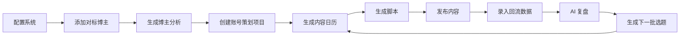
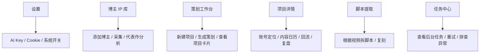

# 使用手册

这份手册更偏“怎么实际把项目用起来”，适合：

- 第一次接触项目的新成员
- 运营 / 策划 / 负责人培训
- 给客户或团队内部做交接

---

## 1. 这个系统到底是干什么的

这套系统不是单纯的“脚本生成器”。

它做的是一条完整的内容增长链路：

简单理解：

- 前半段解决“做什么”
- 后半段解决“做得怎么样、下一轮怎么更好”

---

## 2. 谁每天会用到它

### 运营

主要负责：

- 添加对标博主
- 生成和维护内容日历
- 发布后录回流
- 跟进复盘建议

### 策划

主要负责：

- 梳理账号定位
- 挑选参考博主
- 检查 AI 给出的策划方向
- 把高价值选题推进成脚本

### 老板 / 项目负责人

主要负责：

- 看项目方向是否清晰
- 看回流数据和复盘结果
- 决定下一阶段放大什么内容模式

---

## 3. 第一次拿到系统，先做什么

### 第一步：基础配置

进入：

- `设置 -> 基础配置`

先确认：

- `AI_API_KEY` 已填写
- 登录正常
- 任务中心没有明显异常

### 第二步：配置 Douyin Cookie

进入：

- `设置 -> 爬虫与认证`

推荐做法：

- 复制 `Webhook 地址`
- 加载 Chrome 扩展
- 打开抖音扫码登录
- 扩展自动把 Cookie 回写到系统

如果这一步没完成，很多抖音抓取相关能力会不稳定。

### 第三步：确认后台任务正常

进入：

- `任务中心`

确认：

- worker 在线
- 没有大量失败任务

---

## 4. 一个新运营的标准使用流程

### 4.1 添加 3 到 5 个对标博主

进入：

- `博主 IP 库`

操作：

1. 添加博主主页链接
2. 可选填代表作链接
3. 选择采集数量
4. 开始采集分析

建议：

- 不要只加一个博主
- 最好是同赛道、风格略有差异的 3 到 5 个

### 4.2 先看两个结果

每个博主分析后，重点看：

- `综合报告`
- `爆款归因报告`

最值得关注的字段：

- 核心定位
- 内容策略
- 钩子模式
- 文案风格
- 可复制动作
- 风险提醒

### 4.3 新建账号策划项目

进入：

- `策划工作台`

创建时会经历三步：

1. `互动问诊`
2. `对标参考`
3. `确认生成`

你需要尽量补齐：

- 客户 / 品牌名称
- 行业垂类
- 目标受众画像
- 账号定位与内容支柱

建议：

- 不要只写一句“我要涨粉”
- 写得越具体，后面日历和脚本越靠谱

### 4.4 生成 30 天内容日历

策划完成后，进入项目详情页。

你会看到：

- 账号定位
- 内容策略
- 30 天内容日历

这时不要急着全盘照抄，优先挑：

- 最容易拍的
- 最符合当前资源的
- 最有希望快速验证的

### 4.5 对选中条目生成脚本

先从日历里选 3 到 5 条。

再对这些条目生成脚本。

建议：

- 先跑小样，不要一次性拍满 30 条
- 先找出“能跑通”的内容模型

### 4.6 发布后录回流

进入项目详情页里的回流区域，录入：

- 链接
- 标题
- 播放
- 点赞 / 评论 / 转发
- 完播率
- 转化

建议：

- 不是发完再统一补
- 最好每发一条就回填一条

### 4.7 点 AI 自动复盘

当你有了几条回流数据后，就可以点：

- `AI 自动复盘`

它会告诉你：

- 继续放大什么
- 优先优化什么
- 哪些判断可能是误判
- 下一轮先试什么方向

### 4.8 生成下一批 10 条选题

这一步是为了形成“迭代闭环”。

流程是：

1. 回流
2. 复盘
3. 生成下一批 10 条
4. 选中适合的加入日历
5. 再生成脚本

---

## 5. 页面总览

### 设置

适合做：

- 配置 AI Key
- 配置 Douyin Cookie
- 检查扩展 Webhook 是否正常

### 博主 IP 库

适合做：

- 建立对标样本池
- 看博主画像
- 看爆款归因
- 看代表作深度拆解

### 策划工作台

适合做：

- 新建客户项目
- 管理多个账号项目
- 启动 AI 账号策划

### 项目详情

适合做：

- 看账号定位
- 管理日历
- 录回流
- AI 复盘
- 生成下一批选题

### 任务中心

适合做：

- 看后台任务是不是卡住
- 失败时重试
- 排查 worker 是否正常

---

## 6. 关于代表作，要怎么理解

代表作的作用不是“多存一个链接”，而是让系统能做更深的视频理解。

### 没有代表作时

系统更多依赖：

- 标题
- 描述
- 基础互动数据

这种情况下也能做博主分析，但更偏“文字与选题层”。

### 有代表作时

系统可以额外分析：

- 开头钩子
- 画面节奏
- 拍摄方式
- 文案结构
- 音频风格

所以：

- `常用开头`
- `拍摄手法`
- `音频风格`

这些字段通常会更准确。

建议：

- 代表作尽量选“最典型、最能代表账号调性”的视频

---

## 7. 什么时候该重新采集，什么时候不用

### 适合重新采集

- 博主最近更新了很多新内容
- 你怀疑旧画像已经过时
- 你想比较这个账号前后阶段的内容变化

### 不一定要重新采集

- 只是想重新看策划建议
- 只是想修改项目内容方向
- 只是想继续复盘

---

## 8. AI 自动复盘到底怎么用

很多人会把复盘理解成“系统帮我总结一下数据”，但真正有用的是：

- 找出有效模式
- 找出低效模式
- 决定下一轮怎么拍

复盘后重点看这几块：

### 继续放大什么

说明当前哪些内容方向已经有效，应优先复用。

### 优先优化什么

说明哪些变量最值得改，比如：

- 开头
- 标题
- 节奏
- 结构
- CTA

### 下一批选题方向

这个最实用，因为它直接能接到下一轮日历里。

---

## 9. 下一批 10 条选题怎么用最省钱

推荐流程：

1. 先看 AI 给出的 10 条选题
2. 筛掉不想拍的
3. 只把确定要试的加入内容日历
4. 真正确认后再生成脚本

这样做的好处：

- 不浪费大量 AI 费用
- 不会把“不确定想不想做”的题目都变成脚本

---

## 10. 团队内部推荐 SOP

### 每天

运营：

- 查看昨日发布内容回流
- 录入新数据
- 看任务中心是否异常

### 每周

策划：

- 看一轮 AI 复盘
- 选出下周内容方向
- 补充下一批选题进入日历

### 每月

负责人：

- 看本月哪些内容模式最有效
- 决定下个月主推什么人设 / 选题模型

---

## 11. 常见误区

### 误区 1：一上来就生成很多脚本

更推荐：

- 先跑几条
- 看回流
- 再决定加码

### 误区 2：只看生成结果，不录回流

如果不录回流，这个系统就只能停留在“生成工具”，发挥不出复盘价值。

### 误区 3：对标博主只放一个

只放一个样本容易导致判断过窄。

### 误区 4：代表作随便选

代表作会直接影响深度分析质量。

---

## 12. 给老板看的最简用法

如果老板不想看太多页面，只需要看三处：

1. `策划项目详情`
2. `回流数据摘要`
3. `AI 自动复盘`

够回答这几个问题：

- 我们现在账号定位清不清楚
- 这批内容到底有没有效果
- 下一轮最该加码什么

---

## 13. 如果系统异常，先查哪里

第一层：

- `任务中心`

第二层：

- `docker compose ps`
- `docker compose logs -f backend`
- `docker compose logs -f backend-worker`

第三层：

- Cookie 是否失效
- AI Key 是否可用
- worker 是否在线

---

## 14. 快速结论

如果你只记住一句话：

**这套系统最正确的使用方式，不是“生成完就结束”，而是“生成 -> 发布 -> 回流 -> 复盘 -> 再生成”。**

